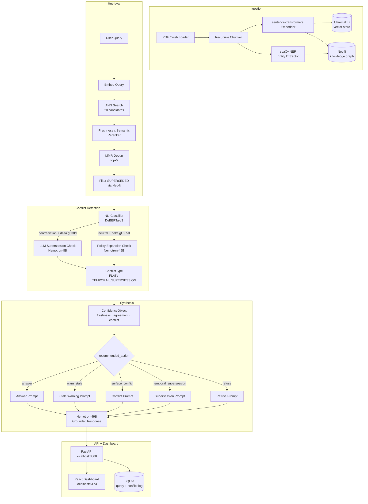

# temporal-rag

A retrieval system that knows *when* its knowledge was written, detects staleness, resolves temporal conflicts, and returns uncertainty-calibrated answers. Built over four WHO ARV guideline PDFs spanning 2013–2023, it scores every source by freshness, classifies contradictions between document versions using a two-stage NLI + LLM pipeline, and routes each query to the right synthesis prompt — answering confidently when sources agree, surfacing conflicts when they don't, and warning explicitly when the knowledge base is stale. Personal portfolio project — no Docker, no cloud infra.

---

## Architecture



---

## Setup

### 1. Prerequisites

- **Python 3.13+** with a virtual environment
- **Neo4j Desktop** — create a local database with:
  - URI: `bolt://localhost:7687`
  - Username: `neo4j`
  - Password: `temporal123`
  - Start the database before running anything
- **NVIDIA NIM API key** — sign up at [build.nvidia.com](https://build.nvidia.com)
- **Node.js 18+** for the dashboard

### 2. Python environment

```bash
python -m venv .venv
source .venv/bin/activate        # Windows: .venv\Scripts\activate
pip install -e .
python -m spacy download en_core_web_lg
```

### 3. Environment variables

Create a `.env` file in the project root:

```env
NVIDIA_API_KEY=your_key_here
NVIDIA_BASE_URL=https://integrate.api.nvidia.com/v1
NVIDIA_MODEL_SMALL=nvidia/llama-3.1-nemotron-nano-8b-v1
NVIDIA_MODEL_LARGE=nvidia/llama-3.3-nemotron-super-49b-v1
NVIDIA_SYNTHESIS_MODEL=nvidia/llama-3.3-nemotron-super-49b-v1
NVIDIA_ORCHESTRATOR_MODEL=nvidia/nemotron-super-120b-instruct
NEO4J_URI=bolt://localhost:7687
NEO4J_USER=neo4j
NEO4J_PASSWORD=temporal123
CHROMA_PATH=./data/chroma
```

### 4. Seed the knowledge base

Place WHO ARV guideline PDFs in `data/sample_docs/`:

| File | Source |
|------|--------|
| `who_arv_guidelines_2013.pdf` | WHO handle 10665/85321 |
| `who_arv_guidelines_2016.pdf` | WHO handle 10665/208825 |
| `who_hiv_guidelines_2021.pdf` | WHO handle 10665/342899 |
| `who_hiv_guidelines_2023.pdf` | WHO handle 10665/376773 |

Then run:

```bash
python seed_data.py
```

This ingests ~4,500 chunks into ChromaDB and Neo4j. Takes 5–10 minutes depending on PDF sizes. Already-seeded sources are skipped automatically.

### 5. Start the API

```bash
uvicorn src.api.main:app --port 8000 --log-level warning
```

### 6. Start the dashboard

```bash
cd dashboard
npm install
npm run dev
```

Open [http://localhost:5173](http://localhost:5173).

---

## Demo Queries

Try these in the dashboard query input or via curl:

```bash
curl -X POST http://localhost:8000/api/query \
  -H "Content-Type: application/json" \
  -d '{"query": "<your query here>"}'
```

| Query | Expected `recommended_action` | Why |
|-------|-------------------------------|-----|
| `"What is the WHO recommendation for when to start ART?"` | `warn_stale` | Sources span 2013–2023; freshness score falls below the stale threshold |
| `"What CD4 count threshold should be used to initiate ART?"` | `surface_conflict` or `temporal_supersession` | 2013 guidelines say CD4 ≤500; 2016 guidelines eliminate the threshold entirely |
| `"Should HIV self-testing be offered in high-prevalence settings?"` | `answer` | Consistent guidance across versions with sufficient freshness |

---

## Dashboard


*Place a screenshot at `docs/dashboard_screenshot.png` after running the app.*

The dashboard shows:
- **Knowledge Decay Heatmap** — freshness by domain, colour-coded green/amber/red
- **Conflict Feed** — recent FLAT and TEMPORAL\_SUPERSESSION detections
- **Query Audit Trail** — every query with recommended action and freshness bar
- **Answer panel + Confidence Card** — grounded response with semantic score, source agreement, and conflict type

---

## Skills and Technologies

| Layer | Technology |
|-------|------------|
| LLM API | NVIDIA NIM (OpenAI-compatible) |
| Synthesis model | `nvidia/llama-3.3-nemotron-super-49b-v1` |
| Small/fast model | `nvidia/llama-3.1-nemotron-nano-8b-v1` |
| NLI classifier | `cross-encoder/nli-deberta-v3-base` |
| Embeddings | `sentence-transformers/all-MiniLM-L6-v2` |
| Vector store | ChromaDB (persistent, local) |
| Knowledge graph | Neo4j 5 (Neo4j Desktop, Bolt protocol) |
| Entity extraction | spaCy `en_core_web_lg` |
| API framework | FastAPI + Uvicorn |
| Frontend | React 18 + Vite + Tailwind CSS + Recharts |
| Audit logging | SQLite (query log + conflict log) |
| PDF parsing | PyMuPDF (fitz) + pdfplumber |
| Language | Python 3.13 |
| Testing | pytest (73 unit tests) |
